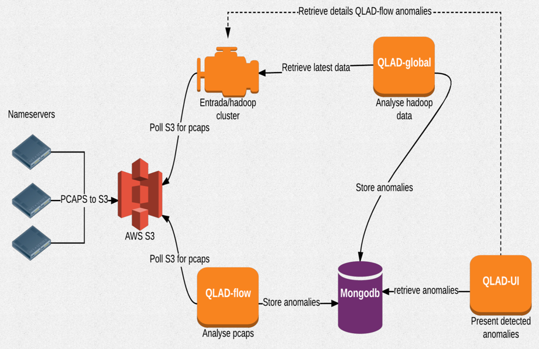

# QLAD

QLAD is the name of a query log analysis and detection platform designed for the high query volume and the specific nature of DNS traffic at a TLD resolver.

It was created in context of the master's thesis of Pieter Robberechts submitted for the degree of Master of Science in Artificial Intelligence at KU Leuven Belgium.
During a student job at DNS Belgium, a proof of concept was further implemented, extended and deployed on AWS infrastructure with continuous intake of pcap data of a couple of name servers.

## Disclaimer

QLAD is distributed in the hope that it will be useful, but WITHOUT ANY WARRANTY; without even the implied warranty of MERCHANTABILITY or FITNESS FOR A PARTICULAR PURPOSE.
The QLAD code is the result of a proof-of-concept.  It is not guaranteed to work and is not ready for production use.

## Documentation

The master's thesis and its presentation slides will be made available later.
For other background information, presentations and screenshots, refer to the documentation/ folder.
Architecture overview:



      
## Various notes

### Intake

- S3 bucket with pcap files : buckets have same name as name server e.g. s3://mybucket/ns1.anycast.ns.dns.be
- Entrada hadoop cluster
  - installed using AWS EMR see <http://docs.aws.amazon.com/emr/latest/ManagementGuide/emr-what-is-emr.html>
  - Entrada (<https://github.com/SIDN/entrada>) 0.0.9 is modified : see entrada/ 
  - deploy by using ansible/entrada_setup.yml but first
        - entrada/dnslib4java : mvn install
        - entrada/pcaplib4java : mvn install
        - entrada/pcap-to-parquet : run mvn package -Dskiptests
        - run create_package.sh in entrada/
  - root data_dir = /mnt/entrada/pcap
    - new pcap files : in /mnt/entrada/pcap/ns1.anycast.ns.dns.be -> 3 files put there each 10 minutes
  - auto-picks new pcap files and processes them
    - Note : update staging stats is outcommented because of issue with old Impala version supported on AWS (1.2.4)
- Graphite (for metrics qlad-flow and entrada) was running on AWS vm <http://ec2host:80/>
- Grafana (for import status into Entrada) was running on AWS vm <http://ec2host:3000/>
- Hadoop
  - list parquet files in staging e.g. `hdfs dfs -ls "/user/hive/entrada/staging/year=2017/month=8/day=3/server=ns1.anycast.ns.dns.be"`
  - after staging->warehouse :
    e.g. ```
[hadoop@ip-10-240-1-30 run]$ hdfs dfs -ls "/user/hive/entrada/queries/year=2017/month=8/day=2/server=ns1.anycast.ns.dns.be"
Found 6 items
-rw-r--r--   1 hadoop hive   43203150 2017-08-03 04:00 /user/hive/entrada/queries/year=2017/month=8/day=2/server=ns1.anycast.ns.dns.be/-5382014716006314553-8265671676965158070_1002018910_data.0
         ```

### Anomaly detection

- MongoDB
  - runs on AWS vm : see `ansible/setup_MongoDB.yml`, run using `ansible-playbook -i hosts ansible/setup_MongoDB.yml`
  
- QLAD-flow
  - was running on AWS ec2host (CentOS)
  - root data_dir = /home/centos/QLAD/captures
  - queries both dns.staging and dns.queries for continuous analysis from s3 bucket
    note : staging has smaller parquet files so Impala queries will be slower (cfr. <http://entrada.sidnlabs.nl/docs/concepts/workflow/>))
  - modified version of git://git.nic.cz/dns-anomaly/
  - modified version of <https://github.com/nbareil/pcap-merge> (because of compressed pcap files)
  - intake of pcap uses modified version of copy-pasted entrada cron scripts
  - deploy : git checkout and run `ansible/setup_QLAD-flow.yml`, use `--extra-vars
    "entrada_src_dir=/Users/username/projects/qlad/entrada" in case your git checkout is not ~/Documents/QLAD)`
  - stores data (anomalies JSON) in mongodb ;
    mongo shell on centos to return first twenty anomalies:
    > use QLAD
    switched to db QLAD
    > db.getCollection("anomalies").find()

- QLAD-global
  - was changed to no longer use DSC as input ; instead does Impala queries

### Middleware

- needs Redis
- uses all code in QLAD-UI/* but not /client
- Express.js


### Frontend

- QLAD-UI
  - was running <http://ec2host:3001>
  - bootstrapped with create-react-app
  - structure based on <https://medium.com/@alexmngn/how-to-better-organize-your-react-applications-2fd3ea1920f1>
  - local deploy : `NODE_PATH=src/ npm run build`

Remote deploy of frontend and middleware with:
`ansible-playbook -i hosts setup_QLAD-UI.yml -D --extra-vars "source_folder=/Users/username/gitrepos/qlad" -v`

## Attribution

This product includes ENTRADA created by <a href="https://www.sidnlabs.nl">SIDN Labs</a>, available from
<a href="http://entrada.sidnlabs.nl">http://entrada.sidnlabs.nl</a>.
